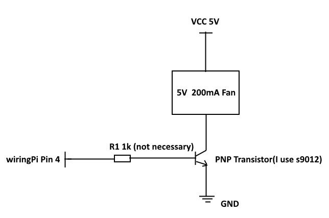

# coolpi

a really simple cooling program for the Raspberry Pi, written in C.

## Dependence

This program is base on wiringPi. Before your trying to build it, do check the installation of wiringPi with the command below.

```bash
gpio -v
```

If everything is fine, you are likely to see the message below.

```bash
gpio version: 2.46
Copyright (c) 2012-2018 Gordon Henderson
This is free software with ABSOLUTELY NO WARRANTY.
For details type: gpio -warranty

Raspberry Pi Details:
  Type: Pi 3+, Revision: 03, Memory: 1024MB, Maker: Sony 
  * Device tree is enabled.
  *--> Raspberry Pi 3 Model B Plus Rev 1.3
  * This Raspberry Pi supports user-level GPIO access.
```

## Hardware

### Pin Number

|  BCM  | WiringPi |  Name   | Phys  | ical  |  Name   | WiringPi |  BCM  |
| :---: | :------: | :-----: | :---: | :---: | :-----: | :------: | :---: |
|       |          |  3.3v   |   1   |   2   |   5v    |          |       |
|   2   |    8     |  SDA.1  |   3   |   4   |   5v    |          |       |
|   3   |    9     |  SCL.1  |   5   |   6   |   0v    |          |       |
|   4   |    7     | GPIO. 7 |   7   |   8   |   TxD   |    15    |  14   |
|       |          |   0v    |   9   |  10   |   RxD   |    16    |  15   |
|  17   |    0     | GPIO. 0 |  11   |  12   | GPIO. 1 |    1     |  18   |
|  27   |    2     | GPIO. 2 |  13   |  14   |   0v    |          |       |
|  22   |    3     | GPIO. 3 |  15   |  16   | GPIO. 4 |    4     |  23   |
|       |          |  3.3v   |  17   |  18   | GPIO. 5 |    5     |  24   |
|  10   |    12    |  MOSI   |  19   |  20   |   0v    |          |       |
|   9   |    13    |  MISO   |  21   |  22   | GPIO. 6 |    6     |  25   |
|  11   |    14    |  SCLK   |  23   |  24   |   CE0   |    10    |   8   |
|       |          |   0v    |  25   |  26   |   CE1   |    11    |   7   |
|   0   |    30    |  SDA.0  |  27   |  28   |  SCL.0  |    31    |   1   |
|   5   |    21    | GPIO.21 |  29   |  30   |   0v    |          |       |
|   6   |    22    | GPIO.22 |  31   |  32   | GPIO.26 |    26    |  12   |
|  13   |    23    | GPIO.23 |  33   |  34   |   0v    |          |       |
|  19   |    24    | GPIO.24 |  35   |  36   | GPIO.27 |    27    |  16   |
|  26   |    25    | GPIO.25 |  37   |  38   | GPIO.28 |    28    |  20   |
|       |          |         |  39   |  40   | GPIO.29 |    29    |  21   |

### Wiring



**The default wiringPi pin that connected to the base of transistor is 4, you can custom it by write your own configure file.**

## Build && install

Easy with a few commad:

```bash
git clone https://github.com/ChanthMiao/coolpi.git
cd coolpi && make
sudo make install
```

## Usage

Well, now the the coolpi should be running as a linux daemon, if everything is ok. This program has maintain a set of defalut configure values that passed my personal test. Yet, you may offer a set of customed values through writting your own configure file.

*The comments is not supported in the configure file. I offer a sample named '/etc/coolpi/sample.json'.*

```json
{
    "con": 4,
    "upperLimit": 48000,
    "onMsec": 20000,
    "lowerLimit": 44000,
    "offMsec": 2000,
    "waitMsec": 1000
}
```

|option|what is it|
|:--:|:----|
|con|wiringPi pin that connected to the base of transistor|
|upperLimit|threshold for turning on the fan ($^\circ C$/k)|
|onMsec|continuous running time of the fan on (ms)|
|lowerLimit|threshold for turning on the fan ($^\circ C$/k)|
|offMsec|continuous waiting time of the fan off (ms)|
|waitMsec|continuous waiting time of the fan when the temperature is in the middle segment (ms)|

Then, modify the line 8 of '/lib/systemd/system/coolpi.service' to the content blow:

```bash
ExecStart=/usr/local/bin/coolpi -c /etc/coolpi/$YOUR_CONFIGURE
```

Reload the '/lib/systemd/system/coolpi.service' with command here:
```bash
sudo systemctl daemon-reload
```

All thing done, have fun with you raspberry Pi 3B+ !

## Note

- If you want to uninstall the coolpi, just one command is needed.

  ```bash
  sudo /etc/coolpi/uninstall.sh
  ```

- Only after your modification of '/lib/systemd/system/coolpi.service', the command "`sudo systemctl daemon-reload`" is needed. If you just want reload your customed configure file, do run the command blow:
  ```bash
  sudo systemctl reload coolpi.service
  ```
